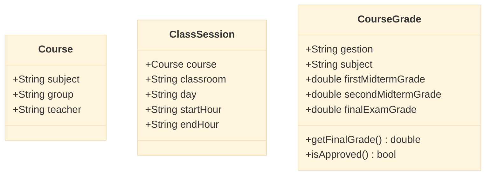
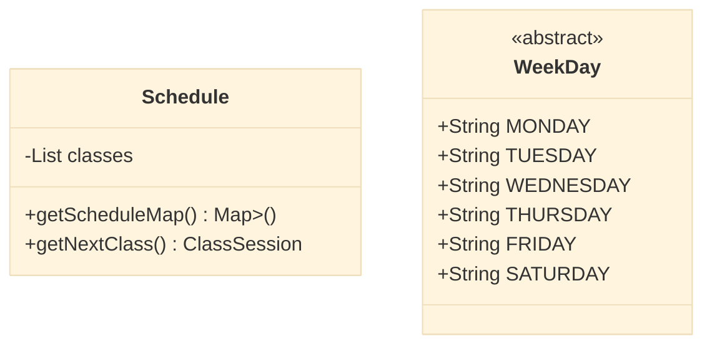
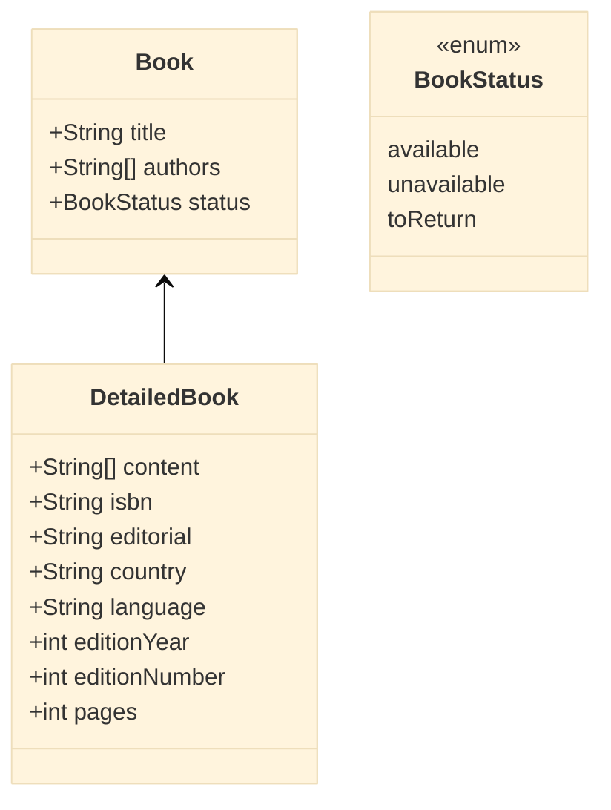

# Class diagram

## Courses, schedule and grades

```mermaid
  %%{init: {'theme':'base'}}%%
  classDiagram

    class Course {
      +String subject
      +String group
      +String teacher
    }

    class ClassSession {
      +Course course
      +String classroom
      +String day
      +String startHour
      +String endHour
    }


    class CourseGrade {
      +String gestion
      +String subject
      +double firstMidtermGrade
      +double secondMidtermGrade
      +double finalExamGrade
      +getFinalGrade() double
      +isApproved() bool
    }

```

```mermaid
  %%{init: {'theme':'base'}}%%
  classDiagram
    class Schedule {
      -List<ClassSession> classes
      +getScheduleMap() : Map<String, List<ClassSession>>()
      +getNextClass() ClassSession
    }


    class WeekDay {
      <<abstract>>
      +String MONDAY
      +String TUESDAY
      +String WEDNESDAY
      +String THURSDAY
      +String FRIDAY
      +String SATURDAY
    }

```

## Library and books

```mermaid
  %%{init: {'theme':'base'}}%%
  classDiagram
    
    Book <-- DetailedBook

    class Book {
    +String title
    +String[] authors
    +BookStatus status
  }

  class DetailedBook {
    +String[] content
    +String isbn
    +String editorial
    +String country
    +String language
    +int editionYear
    +int editionNumber
    +int pages
  }

  class BookStatus {
    <<enum>>
    available
    unavailable
    toReturn
  }

```

