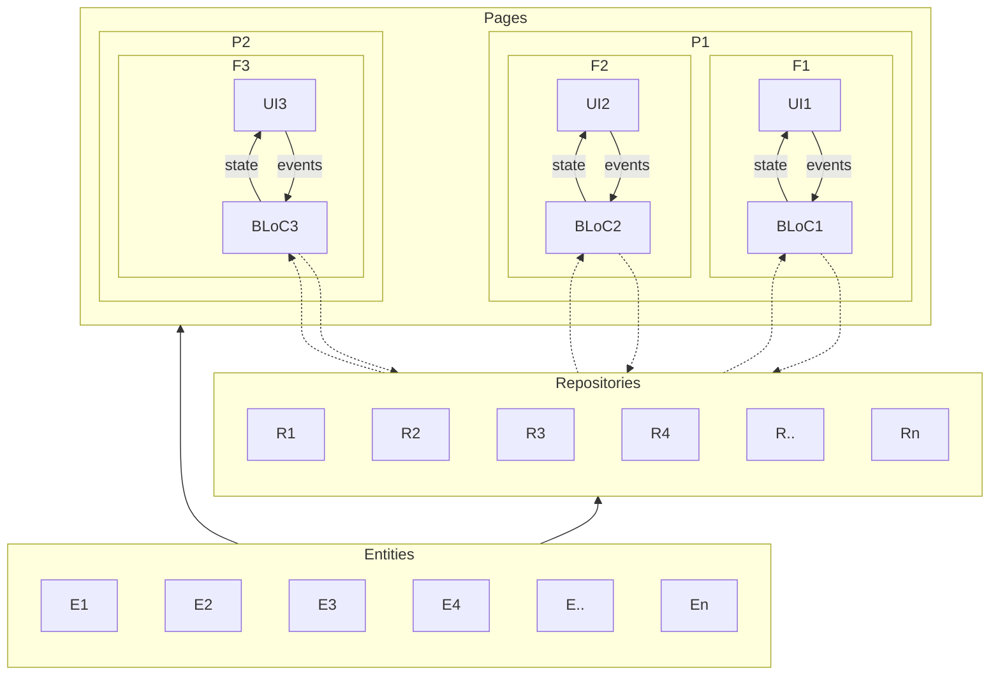

# Overview

In simple words, below we can find the application architecture diagram

* Mainly we have the pages, and each page is a screen that will be presented to the user (Ex.: Log in page, Home page, User profile page, etc.).
* A page can have one or more features (Ex.: Home page has three features: next class, which is related to the schedule; average grade per course, which is related to courses and enrollment; and pending payments, related to the payments.).
* Every feature has its ui (widgets), its BLoC and its definition of events and state to use with the BLoC.