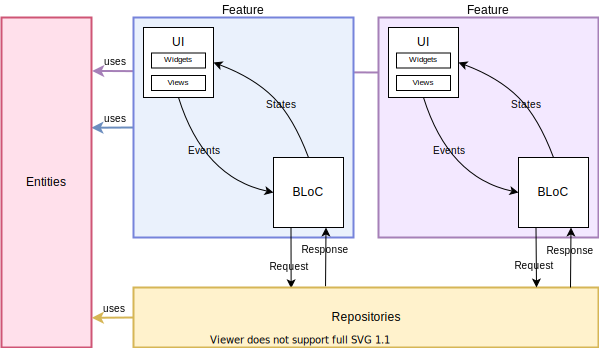

# Architecture
Respecto a la arquitectura, usamos el patrón de arquitectura BLoC, con el paquete  <a href="https://bloclibrary.dev/#/" target="_blank">*flutter_bloc*</a>, además de una estructura basada en features (funcionalidades).  
Se puede visualizar de una mejor manera con el siguiente diagrama:

## Entities
* Al hablar de entidades nos estaremos refiriendo a las clases de la lógica de negocio. Son independientes a paquetes, es decir, no debería existir una entidad que tenga como atributo algún componente de Flutter u otro paquete (ni siquiera los colores!).  
* Algo en común que, por lo general, tendrá cada entidad será un constructor `fromJson()`, el cual nos permitirá instanciar una entidad a partir de una estructura JSON. Esto es útil, por ejemplo, al realizar peticiones HTTP desde los repositories.  
* Las entidades no dependen de nada, pero seguramente todo lo demás dependerá de las entidades, tanto los features como los repositories, despues de todo es la lógica de negocio ;) es por eso que en el diagrama se puede ver esa dependencia de cada elemento con las entidades, a través de las flechas de colores.  
A continuación se encuentra un diagrama de clases, representando las entidades/modelos:  

## Repositories
* Los repositorios son los encargados de obtener datos, absolutamente nada más. Por lo general realizarán peticiones HTTP al servidor, y retornarán la respuesta obtenida utilizando las entities adecuadas.
* Puede existir ocasiones en las que se necesite un manejo de petición de datos más compleja, para esos casos se agregarán *Data Providers*, los cuales se encargarán de hacer las peticiones básicas, y el repositorio asociado se encargará de la complejidad. Puedes ver un poco más sobre esto en la <a href="https://bloclibrary.dev/#/architecture?id=data-layer" target="_blank">documentación de flutter_bloc</a>.  
* Si bien los repositorios sólo pueden ser usados a través de BLoC's, un BLoC no puede instanciar un repository, lo recibirá a través de su constructor desde la UI; esto para tener un código testeable respecto a los BLoC's.
* Puede que haya ocasiones en las que se necesite usar un sólo repository en muchos BLoC's, pero instanciar un nuevo repository cada vez sería ineficiente! Para solucionar esto se utilizará un <a href="https://bloclibrary.dev/#/flutterbloccoreconcepts?id=repositoryprovider" target="_blank">Repository Provider</a>, que se encargará de proveer una sola instancia de un repository a su árbol de widgets descendiente.
## Features
* Un feature es una funcionalidad de la aplicación, por ejemplo, la verificación de conexión a internet, la visualización del horario de un estudiante, el listado de notas, entre otros!
* A veces es difícil definir lo que hará un feature y su alcance de manera específica (por ejemplo, un feature de actividades académicas, que engloba las materias, horario y notas, o tres features: materias, hoario y notas), pero esto cuando ocurra se discutirá entre todos para resolverlo ^^
* Se puede dividir a cada feature en dos: interfaz y lógica. Con la arquitectura BLoC podemos mantener a ambas separadas, siendo la interfaz tanto los widgets personalizados como las vistas/páginas, y la lógica uno o más BLoC's (de preferencia, uno por feature).

### User Interface
* Como ya se mencionó antes, la interfaz de usuario contiene los widgets personalizados propios de ese feature y las vistas.
* Cabe aclarar que, por lo general, las vistas se estructurarán en dos partes: ***page*** y ***view***, siendo la página en donde se crearán los BLoC Providers, repositories, etc. necesarios, y la vista será la vista como tal, en donde se encuentren los widgets de interfaz (Scaffold, containers, imágenes, texto, etc.) .
### BLoC
* Bussiness Logic Component, o componentes de lógica de negocio, en español. Nos ayudarán a mantener la interfaz separada de la lógica, a través de un flujo de eventos-estado, en donde la vista envía eventos a un BLoC, y éste emitirá un nuevo estado; dependiendo de este estado, la interfaz puede cambiar.
* Entonces, para poder usar BLoC's, primero debemos definir cuáles serán los eventos que nuestra interfaz disparará y qué estados tendrá, además de cómo los eventos afectarán el estado. A partir de esta definición ya se pueden construir los BLoC's con sus respectivos estados, eventos, y por supuesto la lógica :)
* Para más información revisa la <a href="https://bloclibrary.dev/#/" target="_blank">documentación oficial de flutter_bloc</a>.
