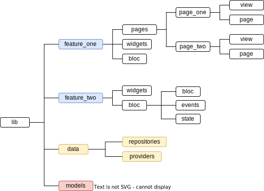

# Folder structure

¿Cómo reflejamos la arquitectura en la estructura de carpetas del proyecto? Hablaremos sobre eso en esta sección :)

## Before starting
Por encima, encontrarás que el proyecto tiene la misma estructura que cualquier proyecto nuevo creado con el CLI de Flutter, sin embargo hay algunas cosas diferentes que explicaremos a continuación:

### Folder `.github`
En esta carpeta se encuentran los workflows usados por GitHub Actions, por ahora sólo se tienen dos: `main.yaml` y `retype-action.yml`:
* **`main.yaml`:** utilizando very_good_workflows, nos ayudará a analizar el código cada vez que se hace un push o un pull request al repositorio de GitHub, tomando en cuenta principalmente el estilo de código, que todos los tests pasen y que se cumpla con un 75% de coverage.
* **`retype-action.yml`:** generará la documentación del proyecto y la publicará en GitHub pages, utilizando la librería Retype y el paquete Dardoc; también contiene algunos pasos adicionales para corregir la estructura de la documentación.
  
Además, también se encuentra el template para los pull requests, el cual nos ayudará a describir mejor nuestros cambios y especificar qué tipo de cambios hemos realizado.

### Files `lib/main_flavor.dart`
Como se mencionó en la anterior sección, el proyecto cuenta con 2 "sabores" principales, **development** y **production**, el archivo de arranque para cada sabor son los archivos main_ seguidos del nombre del sabor, como ser `main_development.dart` y `main_production.dart`, lo cual nos permite separar nuestros ambientes de trabajo según la etapa en la que nos encontramos. 
   
Por defecto se correrá el archivo `main_development.dart`.

### File `lib/bootstrap.dart`
No es necesario prestar mucha atención a este archivo, pero vale la pena saber por qué está ahí:
* Al utilizar el patrón de arquitectura BLoC, podemos saber el estado de la aplicación en todo momento, lo cual es muy conveniente al momento de debuggear o verificar que todo funciona como esperamos que funcione. Sin embargo, no se puede sólo saber el estado de la aplicación sin más, se necesita hacer un poco de configuración, de la cual se encarga este archivo :)
* Dentro de `bootstrap.dart` rodeamos toda nuestra app en un <a href="https://bloclibrary.dev/#/coreconcepts?id=blocobserver-1" target="_blank">Bloc Observer</a>, el cual nos permitirá saber el estado de nuestra app imprimiéndolo en la consola según el tipo de cambio en el estado, ya sea cuando el estado simplemente cambia o cuando ocurre algún error.

### Folder `lib/l10n`
En esta carpeta de guardarán todos los strings usados dentro de la app, permitiendo la internacionalización de la misma.
Por ahora sólo se la desarrollará en español, por lo que esta carpeta está en desuso, pero si en algún momento se desea agregar el inglés o portugués, está lista para ser usada!

### Folder `lib/app`
Simplemente una abstracción para inicializar el Material App usado por al aplicación, además de definir las rutas, para mantenerlo separado del resto de la funcionalidad de la aplicación y así evitar desorden.

## Architecture reflected in folder structure

### Features
Las funcionalidades de la app, una carpeta por funcionalidad. Por lo general, cada feature tendrá sus widgets, páginas y BLoC, pero puede haber casos en los que no tenga páginas, o no tenga widgets. Sin embargo, casi siempre (por no decir siempre) cada feature tendrá un BLoC.

* **Pages:** Contendrá los archivos para cada página, sin importar si es sólo una o son más. Una página en realidad es un concepto más orientado al diseño, como una pantalla, y al ser intuitivo se lo manejará en el proyecto en el proyecto. Sin embargo, para estructurar de forma adecuada una página y no tenga conflictos con los widgets ni el bloc, cada página se dividirá en dos widgets: `page` y `view`.
  * *Page:* Un widget cuya función será sólo inicializar los repositories y bloc's necesarios, ya sea usando un BlocProvider o un RepositoryProvider. Tendrá como child al `view` de la página.
  * *View:* La funcionalidad de este widget será dibujar la pantalla como tal, usando los componentes/widgets necesarios. Está oriendtado a sólo la vista, sin preocuparse de los repositories o bloc's.

* **Widgets:** Los widgets/componentes pertenecientes al feature, que serán usados sólo por ese feature.

* **Bloc:** El Bussiness Logic Object perteneciente al feature, con sus respectivos estados, eventos y el bloc como tal.

### Data

* **Providers:** Contendrá diferentes archivos y clases de Providers. Éstos estarán encargados de hacer peticiones en crudo a la API Rest, una petición por método, un provider puede tener varios métodos.
* **Repositories:** Contendrá diferentes archivos y clases de Repositories. Éstos estarán encargados de llamar a los providers a hacer peticiones y retornar los datos listos para utilizar, cada método puede hacer una o más llamadas a uno o más providers, lo necesario para retornar los datos listos para ser usados.
### Models

Las clases de la lógica de negocio, por lo general, una clase por archivo.

