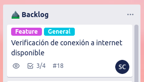
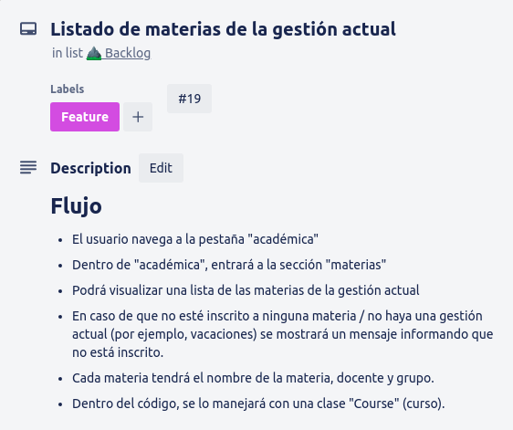
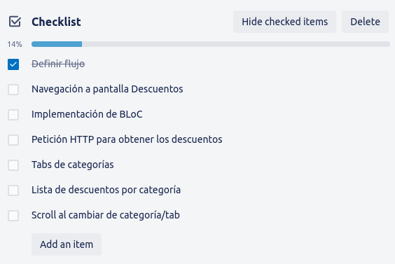
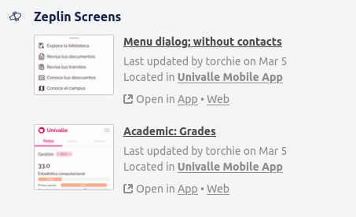
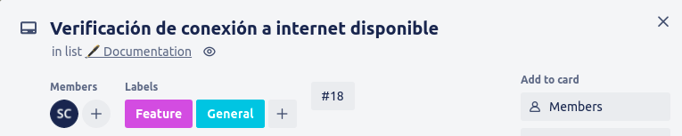
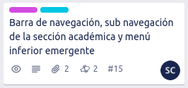

# Adding new features

## Defining feature

Para agregar un nuevo feature, se seguirá el siguiente flujo:  
  
1. Se crea un card en Trello (o se utiliza uno ya existente) en la columna **Backlog**. Éste card tendrá la etiqueta *feature*. En caso de ser algo general y no tan específico (ej.: la navegación, conexión a internet), se agregará también la etiqueta *general*:  
      

2. Dentro del card, se agrega una descripción detallando el feature, como también el flujo de éste. Con flujo nos referimos a los pasos a seguir por el usuario para utilizar el feature:  
      

3. Por comodidad y para aclarar las ideas, se puede agregar una lista de tareas al card, con los pasos a seguir para completar el desarrollo del feature:  
      

4. En caso de que el feature tenga mockups, éstos deben adjuntarse al card a través de Zeplin:  
      

5. Se agrega a los encargados del feature al card.  
    

## Developing feature

Cuando el feature empiece a desarrollarse, éste seguirá el siguiente flujo:

1. Como se utiliza GitFlow como branching model, al iniciar un nuevo feature el encargado del desarrollo del feature debe crear una nueva rama para éste en el repositorio, con el siguiente formato:  
  
    `feature/ #item - título significativo`  

    En donde:
    * **#item** es el número del card perteneciente al feature en Trello.
    * **título significativo** es el título del feature, debe ser lo suficientemente largo o corto para expresar claridad.

    Por ejemplo, en el feature:  
      
    El nombre de su rama será:
    **`feature/15-navigation`**

2. Se mueve el card del feature a la columna/etapa **Development**. Siguiendo la arquitectura, al empezar a desarrollar el feature, se debe crear una carpeta dentro de `lib/` con el nombre del feature (ej.: `lib/connectivity/`) y realizar su desarrollo dentro de esta carpeta.

3. Cuando el desarrollo del feature termine, se ha de escribir los tests correspondientes al feature y el card pasará a la columna/etapa **Testing**. Para que esta etapa se considere terminada, debe tener un coverage de mínimo 80%, aunque lo **ideal es el 100%**

4. Una vez terminada la etapa de testing, se procede con la etapa de documentación y se mueve el card a la respectiva columna (**Documentation**). En esta etapa se ha de agregar la documentación necesaria para que los demás miembros del equipo entiendan el funcionamiento del feature y también puedan trabajar fácilmente con él en caso de que lo necesiten. Se puede encontrar más info sobre cómo escribir documentación en [esta sección](./documentation.md).

5. Terminada la etapa de documentación, el código está listo para subirse. Se creará un pull request desde la rama del feature hacia la rama **develop**, con una descripción de lo que se trabajó. Luego de crear el pull request, el proceso de análisis automático se disparará. En caso de que el análisis no acepte el pull request, se debe seguir trabajando en el feature hasta que este proceso lo apruebe. En caso de que el análisis apruebe el pull request, el feature pasará a la etapa de **Code Review**.

6. Dentro de la etapa **Code Review**, el desarrollador del feature ha de esperar a que su código sea revisado y aprobado por al menos dos personas del equipo, denominadas reviewers. En caso de que los reviewers no aprueben el código, el desarrollador debe seguir con el feature hasta que éste sea aprobado.

7. Una vez el código es aprobado en el code review, el feature es integrado a la rama *develop* y oficialmente está terminado! Ahora se puede mover su card a la columna **Done**.

> Cabe recalcar que en caso de que se encuentren fallos o bugs, un feature siempre puede ser re-abierto, y el proceso descrito anteriormente volverá a iniciar, hasta que el bug sea resuelto. La única diferencia será el nombre de la rama, en donde en lugar de `feature/`, será `fix/`.